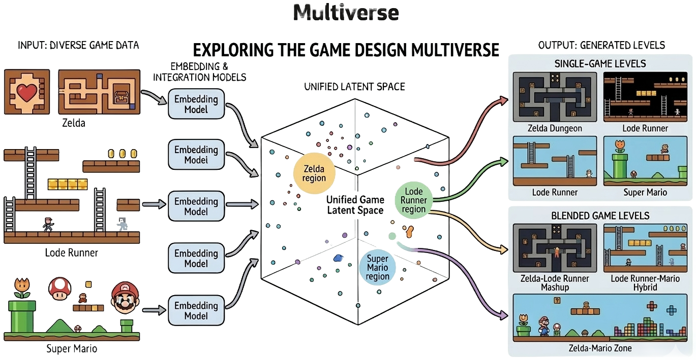

# MGPCGRL: Multi-Game Procedural Content Generation via Representation Learning

[](https://github.com/bic4907/multigame-pcgrl/actions/workflows/multigame-cache-tests.yml)

This repository provides a **multi-game dataset pipeline** for level-text representation learning and controllable level generation.



- **Multiverse** enables one model to generate levels across multiple game domains by learning representations that align level and text features in a **shared embedding space**.
- In this shared space, **text composition and embedding interpolation** can mix characteristics from different games, while instruction structure can control each domain's contribution.
- This shared representation can also serve as a conditioning signal for RL generators such as **PCGRL**, extending to natural-language-driven control of level goals and style.

---

## What Is Included

- Multi-game dataset loader: `dataset/multigame`
- External datasets:
  - `dataset/TheVGLC` (VGLC levels)
  - `dataset/dungeon_level_dataset` (instruction-level pairs)

---

## Installation

```bash
conda create -n mgpcgrl python=3.11
conda activate mgpcgrl
pip install -r requirements.txt
```

---

## Dataset Setup

### Initialize Git Submodules

**Option 1: Clone with all submodules**

```bash
# Clone each submodule
git clone --recursive https://github.com/TheVGLC/TheVGLC dataset/TheVGLC
git clone --recursive https://github.com/bic4907/dungeon-level-dataset dataset/dungeon_level_dataset
git clone --recursive https://github.com/google-deepmind/boxoban-levels dataset/boxoban_levels
git clone --recursive https://github.com/TimMerino1710/five-dollar-model dataset/five-dollar-model
```

**Option 2: Initialize in existing repository**

```bash
git submodule update --init --recursive
```

**Option 3: Update submodules (if already cloned)**

```bash
git -C dataset/TheVGLC pull --ff-only
git -C dataset/dungeon_level_dataset pull --ff-only
git -C dataset/boxoban_levels pull --ff-only
git -C dataset/five-dollar-model pull --ff-only

git submodule update --init --recursive
```

**Verify:**

```bash
git submodule status
```

**Expected submodules** (from `.gitmodules`):
- `dataset/TheVGLC` - VGLC games (Doom, Zelda etc.)
- `dataset/dungeon_level_dataset` - Dungeon with text
- `dataset/boxoban_levels` - Boxoban/Sokoban levels
- `dataset/five-dollar-model` - Pokemon levels

---

## Multi-Game Dataset Quick Start

### 1) Load all available games

```python
from dataset.multigame import MultiGameDataset

ds = MultiGameDataset(include_dungeon=True)
print(len(ds))
print(ds.available_games())

sample = ds[0]
print(sample.game, sample.array.shape, sample.instruction)
```

### 2) Dungeon-only (level-text pairs)

```python
from pathlib import Path
from dataset.multigame import MultiGameDataset

ds = MultiGameDataset(
    vglc_games=[],
    vglc_root=Path("__disable_vglc__"),
    include_dungeon=True,
)

pairs = [(s.game, s.array, s.instruction) for s in ds.with_instruction()]
print(len(pairs))
```

### 3) Filter by game

```python
from dataset.multigame import MultiGameDataset, GameTag

ds = MultiGameDataset(include_dungeon=True)
zelda_samples = ds.by_game(GameTag.ZELDA)
dungeon_samples = ds.by_game(GameTag.DUNGEON)
print(len(zelda_samples), len(dungeon_samples))
```

For more dataset details:
- `dataset/multigame/README.md`
