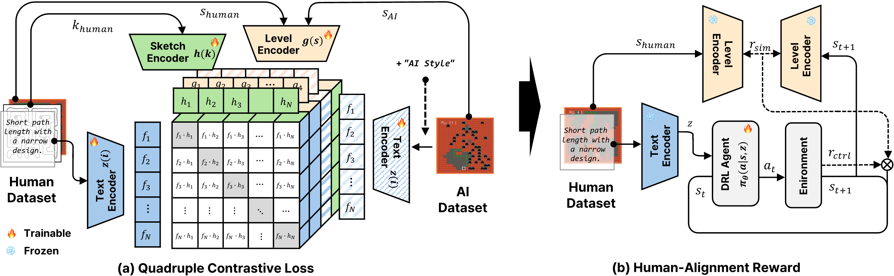

# VIPCGRL: Human-Aligned Procedural Level Generation Reinforcement Learning via Text-Level-Sketch Shared Representation

## Overview
Official codebase for VIPCGRL: Human-Aligned Procedural Level Generation Reinforcement Learning via Text-Level-Sketch Shared Representation




## Task & Reward functions
We have defined five controllable tasks, and the descriptions and implementations of the reward functions for each task are as follows.

Each reward function is converted into actual rewards through [reward calculation code](evaluator/reward.py) and used for training.

| Task Name       | Task Description                                                               | Reward Function |
|-----------------|--------------------------------------------------------------------------------|-----------------|
| Number of Regions          | Controls the number of independent regions in the level                        | [code](evaluator/rewards/region.py)|
| Path Length     | Controls the target distance between any two reachable points within the level | [code](evaluator/rewards/path_length.py)|
| Wall Distribution | Controls the target number of wall tiles in the level                          | [code](evaluator/rewards/amount.py)|
| Moster Distribution  | Controls the target number of bat tiles placed in the level                    | [code](evaluator/rewards/amount.py)|
| Moster Direction   | Controls the distribution of bat tiles across the four cardinal directions     | [code](evaluator/rewards/direction.py)|


## Instruction Dataset
The dataset of instructions used in the paper's experiments is as follows:

| Instruction Task Type | Dataset csv                                                             |
|-----------------------|-------------------------------------------------------------------------|
| With AI-style         | [scn-1_se-whole.csv](instruct/sub_condition/humanai/scn-1_se-whole.csv) |
| Without AI-style      | [scn-1_se-whole.csv](instruct/sub_condition/bert/scn-1_se-whole.csv)    |


The dataset of input modalities used in the paper's experiments is as follows:

| Input Modalities | Dataset csv                                    |
|------------------|------------------------------------------------|
| Level State      | [numpy](dataset/numpy) / [figure](dataset/png) |
| Sketch data      | [sketch](dataset/sketch)                       |

Figure of level state data can be translated into sketch data using the sketch translation code available at [sketch translation code](sketch_style_transfer/translater.ipynb).


## Implementation Detail
### Quadruple Train Loss Implementation
The implementation of our **quadruple contrastive loss**, used to train the multimodal encoder, can be found in [`train_clip.py`](train_clip.py), inside the `train_step()` function  (from approximately **line 45 to 161**).


### Similarity Reward Implementation
The proposed **similarity reward**, used during policy training, is implemented in [`train.py`](train.py), inside the `_env_step()` function (from approximately **line 568 to 616**).

This reward encourages the agent to generate game maps that resemble the **style of human-designed levels**, by comparing the agent's current state with the embedding of a reference map (`human_demo`) sampled from the human dataset.


# How to Run
## Installation
1. Create a Conda Environment with Python 3.11
    ```bash
    conda create -n vipcgrl python=3.11
    conda activate vipcgrl
    ```
2. Install Required Dependencies
    ```bash
    pip install -r requirements.txt
    ```

## Dataset Setup
Run the following commands from the project root (`multigame-pcgrl`).

1. Clone both external datasets (recursive):
    ```bash
    git clone --recursive https://github.com/TheVGLC/TheVGLC dataset/TheVGLC
    git clone --recursive https://github.com/bic4907/dungeon-level-dataset dataset/dungeon_level_dataset
    ```

2. If the folders already exist, update them instead of cloning again:
    ```bash
    git -C dataset/TheVGLC pull --ff-only
    git -C dataset/dungeon_level_dataset pull --ff-only
    ```

3. Ensure nested submodules (if any) are initialized:
    ```bash
    git -C dataset/TheVGLC submodule update --init --recursive
    git -C dataset/dungeon_level_dataset submodule update --init --recursive
    ```

4. (Optional) Quick check:
    ```bash
    ls dataset
    git -C dataset/TheVGLC remote -v
    git -C dataset/dungeon_level_dataset remote -v
    ```


## Encoder Training
- IPCGRL
    ```bash
    python train_encoder.py batch_size=128 
    ```

- VIPCGRL
    ```bash
    python train_clip.py batch_size=128 img_data_path=./dataset
    ```


## Train RL Policy
#### Instruction Options
- `scn-1_se-1`
- `scn-1_se-2`
- `scn-1_se-3`
- `scn-1_se-4`
- `scn-1_se-5`
  
    ➡️ **Choose one** instruction for each run.

#### Commands
- CPCGRL
    ```bash
    python train.py overwrite=True instruct=<INSTRUCTION> n_envs=500 seed=0 vec_cont=True raw_obs=True 
    ```
    
- IPCGRL
    ```bash
    python train.py overwrite=True instruct=<INSTRUCTION> n_envs=500 seed=0 encoder.model='mlp' encoder.ckpt_dir=./saves
    ```
    
- VIPCGRL
    ```bash
    python train.py encoder.model=cnnclip overwrite=True n_envs=500 instruct=<INSTRUCTION> seed=0 SIM_COEF=30 encoder.ckpt_dir=./saves
    ```


## Evaluate RL Policy
#### Instruction Options
- `scn-1_se-1`
- `scn-1_se-2`
- `scn-1_se-3`
- `scn-1_se-4`
- `scn-1_se-5`
  
    ➡️ **Choose one** instruction for each run.

####  Evaluation Modalities (only for VIPCGRL)
- `text`
- `state`
- `sketch`
  
    ➡️ **Choose one** eval_modality for each run.


#### Commands
- Random
    ```bash
    python eval.py overwrite=True instruct=scn-1_se-whole random_agent=True exp_name=rd seed=0
    ```

- CPCGRL
    ```bash
    python eval.py instruct=<INSTRUCTION> n_envs=100 seed=0 vec_cont=True raw_obs=True reevaluate=True 
    ```
    
- IPCGRL
    ```bash
    python eval.py instruct=<INSTRUCTION> n_envs=100 seed=0 encoder.model='mlp' reevaluate=True encoder.ckpt_dir=./saves
    ```

- VIPCGRL
    ```bash
    python eval.py encoder.model=cnnclip n_envs=100 instruct=<INSTRUCTION> seed=0 SIM_COEF=30 encoder.ckpt_dir=./saves reevaluate=True eval_instruct=scn-1_se-whole eval_modality=<EVAL MODALTITY>
    ```
