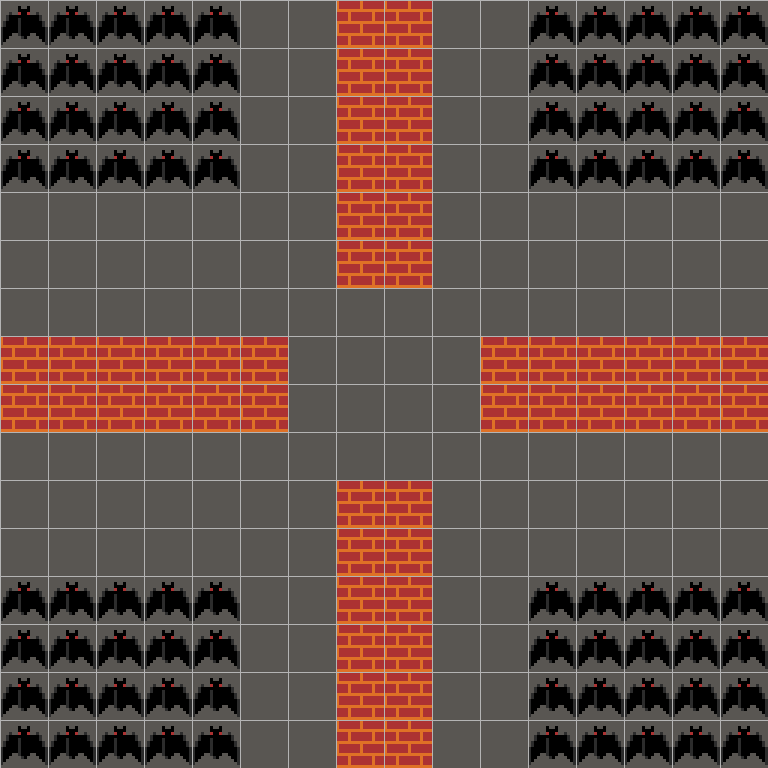
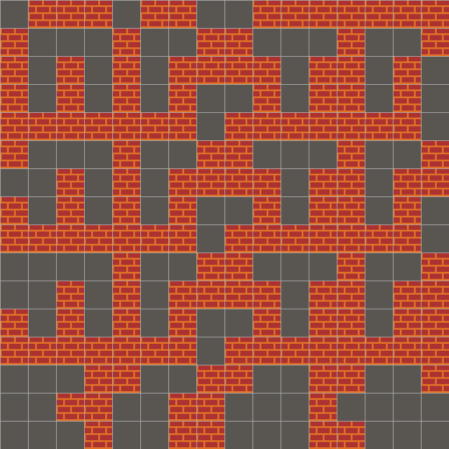
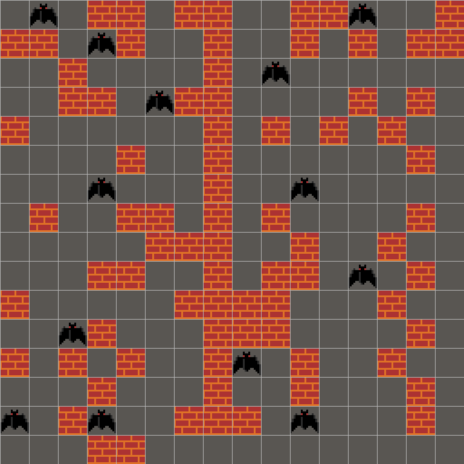
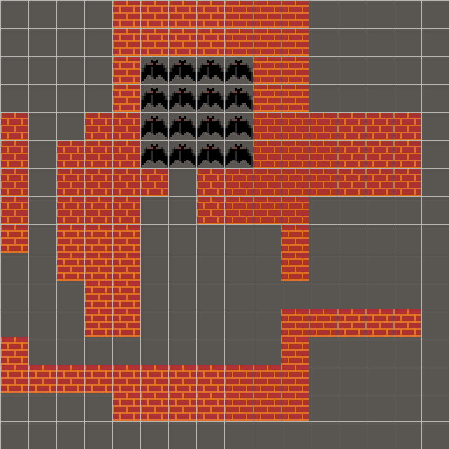
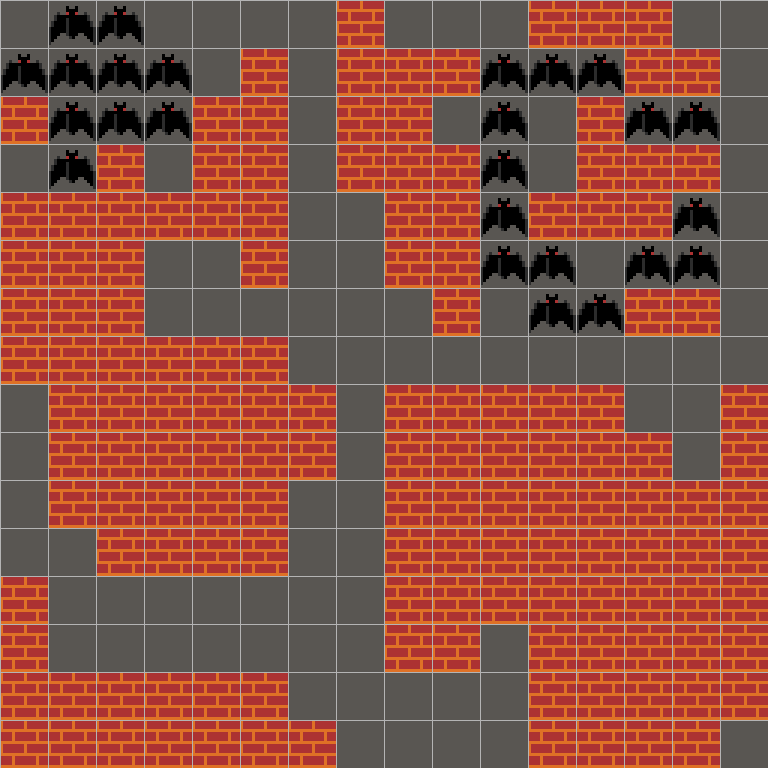
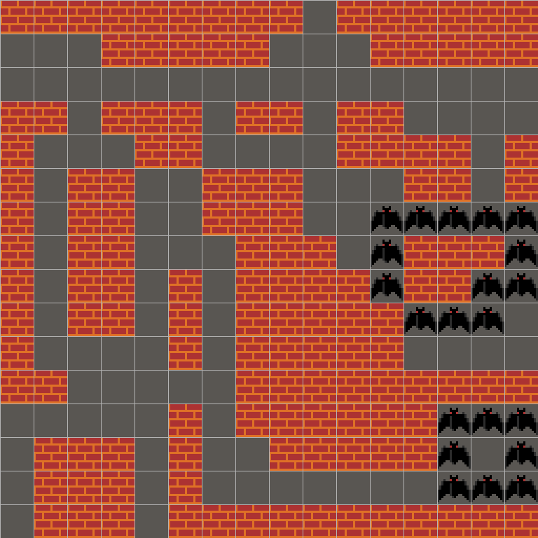
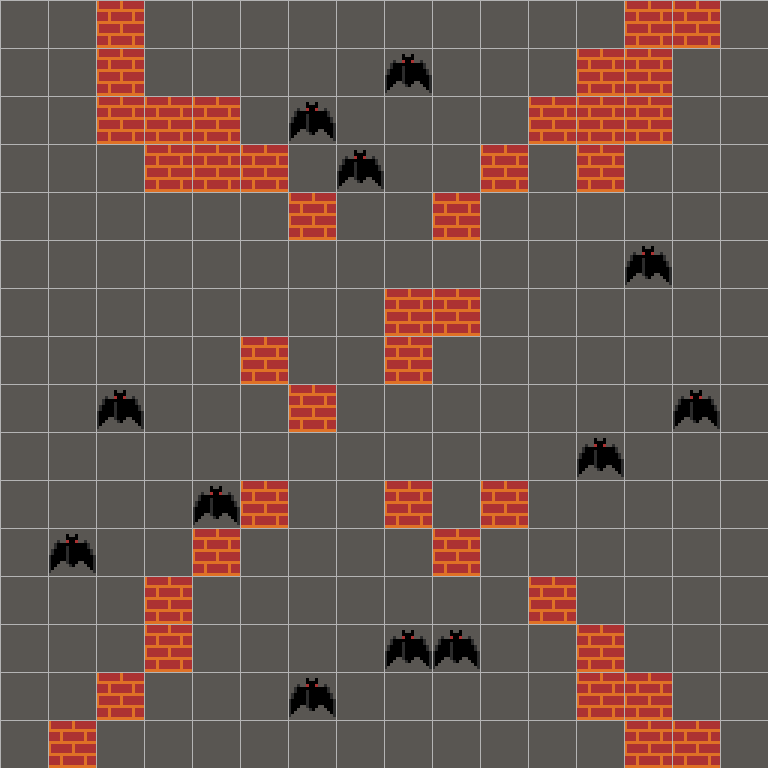
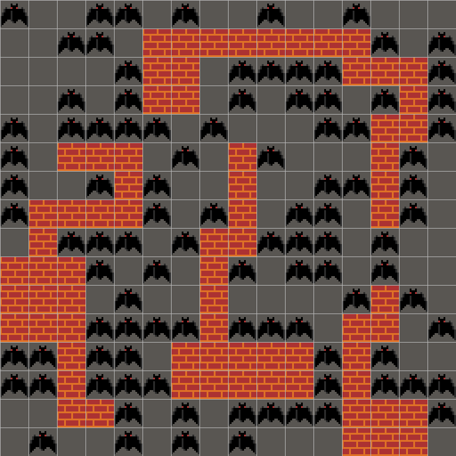
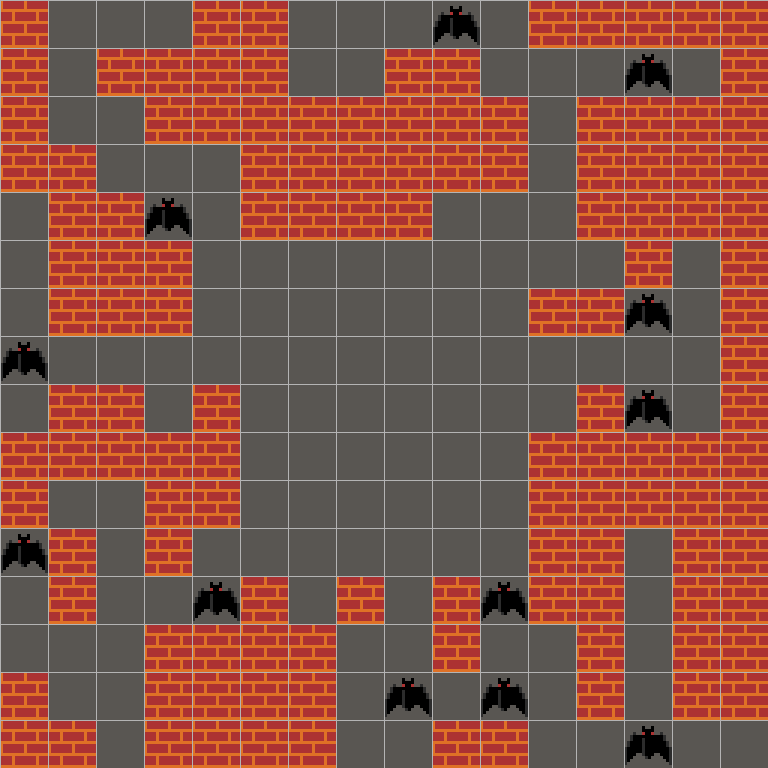
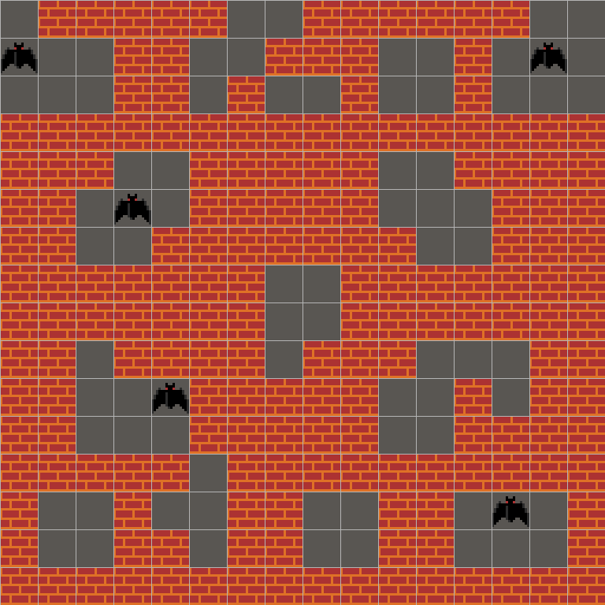

# 🗺️ Dungeon Level Dataset

A text-conditioned procedural dungeon level dataset crafted by **human designers**.  
GPT-4.1 was used to generate initial draft levels, which were then **manually reviewed and refined** by human designers to ensure quality and consistency.  
Each sample is a **16×16 tile-grid** paired with a natural-language instruction that describes the spatial characteristics of the level.

---

## 📦 Dataset at a Glance

| Item | Value |
|------|-------|
| Total samples | **5,052** |
| Instruction categories | **160** |
| Grid resolution | **16 × 16** |
| Tile vocabulary | `1` floor · `2` wall · `3` enemy |
| Array dtype | `int64` |
| Generator | GPT-4.1 draft → human refinement |

---

## 🗂️ Repository Structure

```
dungeon-level-dataset/
├── dungeon_levels.npz          # All levels packed into one compressed archive
├── dungeon_levels_metadata.csv # Metadata: maps every array key → instruction & details
├── dataset.py                  # DungeonLevelDataset / Instruction / LevelArray classes
├── build_dataset.py            # Script used to build the above two files
├── build_samples.py            # Script used to generate sample previews
├── requirements.txt            # Python dependencies
└── samples/
    ├── numpy/                  # 10 random sample .npy files
    └── rendered/               # 10 rendered PNG images of the samples
```

---

## 🔢 Tile Legend

| Value | Tile | Description |
|-------|------|-------------|
| `1` | 🟫 Floor | Walkable open space |
| `2` | ⬜ Wall | Impassable barrier |
| `3` | 🔴 Enemy | Tile occupied by an enemy unit (bat) |

---

## 📋 Metadata CSV — `dungeon_levels_metadata.csv`

Each row describes one sample:

| Column | Description |
|--------|-------------|
| `index` | Global 0-based integer index |
| `key` | Zero-padded key used in the `.npz` file (e.g. `000042`) |
| `instruction` | Human-readable instruction string |
| `instruction_slug` | Snake-case category name |
| `level_id` | Numeric level identifier from the generator |
| `sample_id` | Sample index within the same level |

---

## 📦 Requirements

```bash
pip install -r requirements.txt
```

| Package | Version | Purpose |
|---------|---------|---------|
| `numpy` | ≥ 1.24 | Array loading & manipulation (`dataset.py`, `build_dataset.py`) |
| `opencv-python` | ≥ 4.8 | Tile image rendering (`build_samples.py`) |

> `dataset.py` only requires **NumPy** — no other dependencies needed for loading the dataset.

---

## 🚀 Quick Start

Import `DungeonLevelDataset` from `dataset.py` — no external dependencies beyond NumPy.

```python
from dataset import DungeonLevelDataset

ds = DungeonLevelDataset()
# DungeonLevelDataset(samples=5052, categories=160)
```

### Index access

```python
level = ds[0]                  # LevelArray

print(level.instruction)       # "a balanced path length with narrow characteristics is created"
print(level.array)             # numpy ndarray, shape (16, 16), dtype int64
print(level.array.shape)       # (16, 16)
print(level.level_id)          # 51
print(level.sample_id)         # 0

# Tile helpers
print(level.n_floor)           # number of floor tiles
print(level.n_wall)            # number of wall tiles
print(level.n_enemy)           # number of enemy tiles
print(level.floor_mask)        # boolean (16, 16) mask
```

### Iterate over all levels

```python
for level in ds:
    process(level.array)
```

### Filter by keyword

```python
bat_levels = ds.filter("bat swarm")   # list[LevelArray]
print(len(bat_levels))                # 64

for level in bat_levels:
    print(level.instruction, level.array.shape)
```

### Group by instruction

```python
instr = ds.group("a radial bats pattern forms across the top")
# Instruction(slug='a_radial_bats_pattern_forms_across_the_top', samples=32)

print(instr.instruction)       # human-readable string
print(len(instr))              # 32

# Stack all samples into a single array
arrays = instr.arrays()        # shape (32, 16, 16)

# Iterate samples
for level in instr:
    print(level.sample_id, level.array.shape)
```

### List all instruction categories

```python
for instr in ds.instructions():
    print(f"[{len(instr):3d}]  {instr.instruction}")

# or just the names
names = ds.category_names()    # list[str], length 160
```

---

## 🏷️ Instruction Categories

The 160 instruction categories span four main concept groups:

| Group | Example instructions |
|-------|----------------------|
| **Path length & corridor type** | `a short, narrow path length appears`, `long and wide path fills the map` |
| **Enemy (bat) placement** | `a bat swarm of clustered units emerges`, `bats spread along the south in radial form` |
| **Region / room layout** | `a few large regions are present`, `many small regions dominate the map` |
| **Block density & distribution** | `dense centralized blocks fill the area`, `sparse and decentralized blocks occupy the map` |

---

## 🖼️ Sample Previews

10 randomly selected levels (seed 42) from diverse instruction categories:

| | | | | |
|:---:|:---:|:---:|:---:|:---:|
|  |  |  |  |  |
| *a dense group of clustered bats appears* | *a multi-region cluster of large rooms is formed* | *a number of decentralized blocks is spread out* | *a radial bats pattern forms across the top* | *bats are grouped in the north in a radial layout* |
|  |  |  |  |  |
| *eastern region holds radial bat presence* | *few decentralized blocks appear in a light layout* | *large scattered bat group dominates the area* | *the centralized blocks create dense barriers* | *the map has some small regions* |

Raw `.npy` files for these samples are available in `samples/numpy/`.

---

## 📐 Data Generation

Each level was created through a two-stage process:

1. **Draft generation** — GPT-4.1 was prompted with a natural-language instruction to produce an initial 16×16 tile-grid.
2. **Human refinement** — Human designers manually reviewed every draft, correcting tile placements and ensuring the level faithfully reflects the given instruction.

Multiple independent samples (≈ 30 per instruction on average) were collected and refined per category.

---

## 📜 License

This dataset is released for research and educational use.

---

## 🙏 Citation

If you use this dataset in your research, please cite the accompanying paper:

```bibtex
@article{baek2025human,
  title   = {Human-Aligned Procedural Level Generation Reinforcement Learning via Text-Level-Sketch Shared Representation},
  author  = {Baek, In-Chang and Lee, Seoyoung and Kim, Sung-Hyun and Hwang, Geumhwan and Kim, KyungJoong},
  journal = {arXiv preprint arXiv:2508.09860},
  year    = {2025}
}
```
